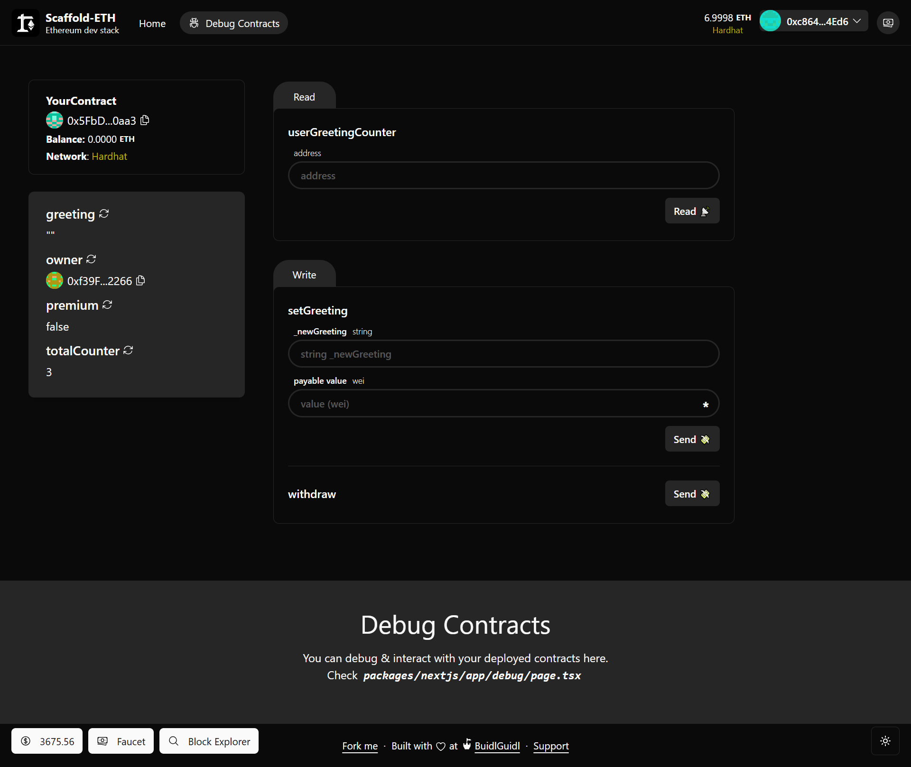

# 🏗 Scaffold-ETH 2

<h4 align="center">
  <a href="https://docs.scaffoldeth.io">Documentation</a> |
  <a href="https://scaffoldeth.io">Website</a>
</h4>

🧪 An open-source, up-to-date toolkit for building decentralized applications (dapps) on the Ethereum blockchain. It's designed to make it easier for developers to create and deploy smart contracts and build user interfaces that interact with those contracts.

⚙️ Built using NextJS, RainbowKit, Foundry/Hardhat, Wagmi, Viem, and Typescript.

## ✨ Features

All the powerful features of Scaffold-ETH 2, plus:
- 🎨 **Premium UI Components**: Leveraging shadcn/ui's beautifully crafted, accessible components
- 🌓 **Enhanced Theme Switching**: Sophisticated dark/light mode implementation
- ♿ **Improved Accessibility**: Better ARIA support and keyboard navigation
- 🎯 **Type-safe Components**: Fully typed component library for better developer experience
- 🔧 **Easy Customization**: Tailwind CSS-based styling with shadcn/ui's theming system

Plus all the standard SE-2 features:
- ✅ **Contract Hot Reload**: Your frontend auto-adapts to your smart contract as you edit it.
- 🪝 **[Custom hooks](https://docs.scaffoldeth.io/hooks/)**: Collection of React hooks wrapper around [wagmi](https://wagmi.sh/) to simplify interactions with smart contracts with typescript autocompletion.
- 🧱 [**Components**](https://docs.scaffoldeth.io/components/): Collection of common web3 components to quickly build your frontend.
- 🔥 **Burner Wallet & Local Faucet**: Quickly test your application with a burner wallet and local faucet.
- 🔐 **Integration with Wallet Providers**: Connect to different wallet providers and interact with the Ethereum network.


## Additional Setup for shadcn/ui

This version includes shadcn/ui components. Here's what you need to know:

1. Components are pre-configured and ready to use
2. Themes are defined in `packages/nextjs/styles/globals.css`
3. New shadcn/ui components can be added using:
```bash
npx shadcn-ui@latest add [component-name]
```



## Requirements

Before you begin, you need to install the following tools:

- [Node (>= v18.18)](https://nodejs.org/en/download/)
- Yarn ([v1](https://classic.yarnpkg.com/en/docs/install/) or [v2+](https://yarnpkg.com/getting-started/install))
- [Git](https://git-scm.com/downloads)

## Quickstart

To get started with Scaffold-ETH 2, follow the steps below:

1. Install the latest version of Scaffold-ETH 2

```
npx create-eth@latest
```

This command will install all the necessary packages and dependencies, so it might take a while.

> [!NOTE]
> You can also initialize your project with one of our extensions to add specific features or starter-kits. Learn more in our [extensions documentation](https://docs.scaffoldeth.io/extensions/).

2. Run a local network in the first terminal:

```
yarn chain
```

This command starts a local Ethereum network that runs on your local machine and can be used for testing and development. Learn how to [customize your network configuration](https://docs.scaffoldeth.io/quick-start/environment#1-initialize-a-local-blockchain).

3. On a second terminal, deploy the test contract:

```
yarn deploy
```

This command deploys a test smart contract to the local network. You can find more information about how to customize your contract and deployment script in our [documentation](https://docs.scaffoldeth.io/quick-start/environment#2-deploy-your-smart-contract).

4. On a third terminal, start your NextJS app:

```
yarn start
```

Visit your app on: `http://localhost:3000`. You can interact with your smart contract using the `Debug Contracts` page. You can tweak the app config in `packages/nextjs/scaffold.config.ts`.

**What's next**:

Visit the [What's next section of our docs](https://docs.scaffoldeth.io/quick-start/environment#whats-next) to learn how to:

- Edit your smart contracts
- Edit your deployment scripts
- Customize your frontend
- Edit the app config
- Writing and running tests
- [Setting up external services and API keys](https://docs.scaffoldeth.io/deploying/deploy-smart-contracts#configuration-of-third-party-services-for-production-grade-apps)

## Documentation

Visit our [docs](https://docs.scaffoldeth.io) to learn all the technical details and guides of Scaffold-ETH 2.
For shadcn/ui documentation, visit [shadcn/ui docs](https://ui.shadcn.com).

To know more about its features, check out our [website](https://scaffoldeth.io).

## Contributing to Scaffold-ETH 2

We welcome contributions to Scaffold-ETH 2!

Please see [CONTRIBUTING.MD](https://github.com/scaffold-eth/scaffold-eth-2/blob/main/CONTRIBUTING.md) for more information and guidelines for contributing to Scaffold-ETH 2.
